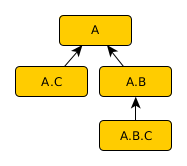

# Logging

## Simple logging

    import logging
    import os

    PATH_FILE_LOG = os.path.join('/tmp', 'basic.log')
    SESSION = '1234'

    logging.basicConfig(filename=PATH_FILE_LOG,
                        level=logging.DEBUG,
                        # https://docs.python.org/3.6/library/logging.html#logrecord-attributes
                        format=f'%(asctime)s {SESSION} %(levelname)s %(message)s',
                        datefmt='%Y%m%d-%I%M%S')
    logging.debug('This is an DEBUG message')
    logging.info('This is an INFO message')
    logging.warning('This is a WARNING message')
    logging.error('This is an ERROR message')
    logging.critical('This is a CRITICAL message')

* List of all available message attributes: [message attributes](https://docs.python.org/3.6/library/logging.html#logrecord-attributes)
* List of all available configuration parameters: [configuration parameters](https://docs.python.org/3.6/library/logging.html#logging.basicConfig)

This example above writes messages in a file with the following format:

    20190318-104122 1234 DEBUG This is an DEBUG message
    20190318-104122 1234 INFO This is an INFO message
    20190318-104122 1234 WARNING This is a WARNING message
    20190318-104122 1234 ERROR This is an ERROR message
    20190318-104122 1234 CRITICAL This is a CRITICAL message

> This is good enough for simple uses. However, it may not be suitable for a production environment.

## Custom formatter

[This example](code/logging_formatter.py) shows how to build a custom formatter.

This example above writes messages in a file with the following format:

    20190319-124623 aqszed R __main__ DEBUG This is an DEBUG message
    20190319-124623 aqszed R __main__ INFO This is an INFO message
    20190319-124623 aqszed R __main__ WARNING This is a WARNING message
    20190319-124623 aqszed R __main__ ERROR This is an ERROR message
    20190319-124623 aqszed R __main__ CRITICAL This is a CRITICAL message
    20190319-124623 aqszed L-09ef1a __main__ INFO bash-3.2%24%20python%20test2.py%0Asome%20text%20in%20single%20line%0AAs%20opposed%20to%0Asome%20text%0Awritten%20as%0Aheredoc%0Aand%2
    0then%20another%20single%20line
            # 09ef1a # bash-3.2$ python test2.py
            # 09ef1a # some text in single line
            # 09ef1a # As opposed to
            # 09ef1a # some text
            # 09ef1a # written as
            # 09ef1a # heredoc
            # 09ef1a # and then another single line

## Using several handlers

A logger handles messages through _handlers_.

Each _handler_ has its own configuration in terms of:

* the severity level (DEBUG, INFO...).
* output (file, emails, HTTP requests...).
* formatting.

> Please note, however, that, even though each handler is configured with a severity level, the logger is also configured with a severity level. **And the logger configuration, in terms of severity level, overwrites the configuration of all its handlers**. That is, if the severity level assigned to the logger is `WARNING` (_which is the default value, by the way_), then no messages with the lower severity level will be processed, even if a handler is configured to handle messages with a lower severity level (`DEBUG` or `INFO`).

[This example](code/logging_levels.py) illustrates the use of handlers.

If you run this example, you will get two LOG files:

* `/tmp/std.log`
* `/tmp/secure.log`

**`/tmp/std.log`**

    20190319-085745 log DEBUG low priority message 1
    20190319-085745 log INFO low priority message 2
    20190319-085745 log WARNING high priority message 1
    20190319-085745 log WARNING URGENT high priority message 1
    20190319-085745 log ERROR high priority message 2
    20190319-085745 log ERROR URGENT high priority message 2
    20190319-085745 log CRITICAL high priority message 3
    20190319-085745 log CRITICAL URGENT high priority message 3

**`/tmp/secure.log`**

    20190319-085745 log WARNING SECURE high priority message 1
    20190319-085745 log ERROR SECURE high priority message 2
    20190319-085745 log CRITICAL SECURE high priority message 3

## Defining a hierarchy of loggers

Loggers can be organised in a hierarchical way, similar to the way UI components are organised in a user interface. 

In [this example](code/logging_tree.py), we build a 3 levels hierarchy:

By default, all messages emitted by the logger "`A.B.C`" will bubble up to the top level "`A`".

However, this behaviour can be altered by setting the logger property `propagate` to the value `False`.

Running this script will produce this output:

All loggers propagate the emitted messages:

    STD A.B.C-> 20190320-101452 A.B.C DEBUG TEST 1
    STD A.B-> 20190320-101452 A.B.C DEBUG TEST 1
    STD A-> 20190320-101452 A.B.C DEBUG TEST 1
    STD A.B.C-> 20190320-101452 A.B.C DEBUG debug[abc]
    STD A.B-> 20190320-101452 A.B.C DEBUG debug[abc]
    STD A-> 20190320-101452 A.B.C DEBUG debug[abc]
    STD A.B.C-> 20190320-101452 A.B.C INFO info[abc]
    STD A.B-> 20190320-101452 A.B.C INFO info[abc]
    STD A-> 20190320-101452 A.B.C INFO info[abc]
    STD A.B.C-> 20190320-101452 A.B.C WARNING warning[abc]
    SEC A.B.C-> 20190320-101452 A.B.C WARNING warning[abc]
    STD A.B-> 20190320-101452 A.B.C WARNING warning[abc]
    SEC A.B-> 20190320-101452 A.B.C WARNING warning[abc]
    STD A-> 20190320-101452 A.B.C WARNING warning[abc]
    SEC A-> 20190320-101452 A.B.C WARNING warning[abc]
    STD A.B.C-> 20190320-101452 A.B.C ERROR error[abc]
    SEC A.B.C-> 20190320-101452 A.B.C ERROR error[abc]
    STD A.B-> 20190320-101452 A.B.C ERROR error[abc]
    SEC A.B-> 20190320-101452 A.B.C ERROR error[abc]
    STD A-> 20190320-101452 A.B.C ERROR error[abc]
    SEC A-> 20190320-101452 A.B.C ERROR error[abc]
    STD A.B.C-> 20190320-101452 A.B.C CRITICAL critical[abc]
    SEC A.B.C-> 20190320-101452 A.B.C CRITICAL critical[abc]
    STD A.B-> 20190320-101452 A.B.C CRITICAL critical[abc]
    SEC A.B-> 20190320-101452 A.B.C CRITICAL critical[abc]
    STD A-> 20190320-101452 A.B.C CRITICAL critical[abc]
    SEC A-> 20190320-101452 A.B.C CRITICAL critical[abc]
    STD A.B.C-> 20190320-101452 A.B.C DEBUG END TEST 1
    STD A.B-> 20190320-101452 A.B.C DEBUG END TEST 1
    STD A-> 20190320-101452 A.B.C DEBUG END TEST 1

Logger "`A.B.C`" does not propagate the emitted messages:

    STD A.B.C-> 20190320-101452 A.B.C DEBUG TEST 2
    STD A.B.C-> 20190320-101452 A.B.C DEBUG debug[abc]
    STD A.B.C-> 20190320-101452 A.B.C INFO info[abc]
    STD A.B.C-> 20190320-101452 A.B.C WARNING warning[abc]
    SEC A.B.C-> 20190320-101452 A.B.C WARNING warning[abc]
    STD A.B.C-> 20190320-101452 A.B.C ERROR error[abc]
    SEC A.B.C-> 20190320-101452 A.B.C ERROR error[abc]
    STD A.B.C-> 20190320-101452 A.B.C CRITICAL critical[abc]
    SEC A.B.C-> 20190320-101452 A.B.C CRITICAL critical[abc]
    STD A.B.C-> 20190320-101452 A.B.C DEBUG END TEST 2

Logger "`A.B`" does not propagate the emitted messages:

    STD A.B.C-> 20190320-101452 A.B.C DEBUG TEST 3
    STD A.B-> 20190320-101452 A.B.C DEBUG TEST 3
    STD A.B.C-> 20190320-101452 A.B.C DEBUG debug[abc]
    STD A.B-> 20190320-101452 A.B.C DEBUG debug[abc]
    STD A.B.C-> 20190320-101452 A.B.C INFO info[abc]
    STD A.B-> 20190320-101452 A.B.C INFO info[abc]
    STD A.B.C-> 20190320-101452 A.B.C WARNING warning[abc]
    SEC A.B.C-> 20190320-101452 A.B.C WARNING warning[abc]
    STD A.B-> 20190320-101452 A.B.C WARNING warning[abc]
    SEC A.B-> 20190320-101452 A.B.C WARNING warning[abc]
    STD A.B.C-> 20190320-101452 A.B.C ERROR error[abc]
    SEC A.B.C-> 20190320-101452 A.B.C ERROR error[abc]
    STD A.B-> 20190320-101452 A.B.C ERROR error[abc]
    SEC A.B-> 20190320-101452 A.B.C ERROR error[abc]
    STD A.B.C-> 20190320-101452 A.B.C CRITICAL critical[abc]
    SEC A.B.C-> 20190320-101452 A.B.C CRITICAL critical[abc]
    STD A.B-> 20190320-101452 A.B.C CRITICAL critical[abc]
    SEC A.B-> 20190320-101452 A.B.C CRITICAL critical[abc]
    STD A.B.C-> 20190320-101452 A.B.C DEBUG END TEST 3
    STD A.B-> 20190320-101452 A.B.C DEBUG END TEST 3

## Configuration

See [logging.config](https://docs.python.org/3.6/library/logging.config.html#module-logging.config)

## Good links

* [Logging in Python](https://realpython.com/python-logging/)
