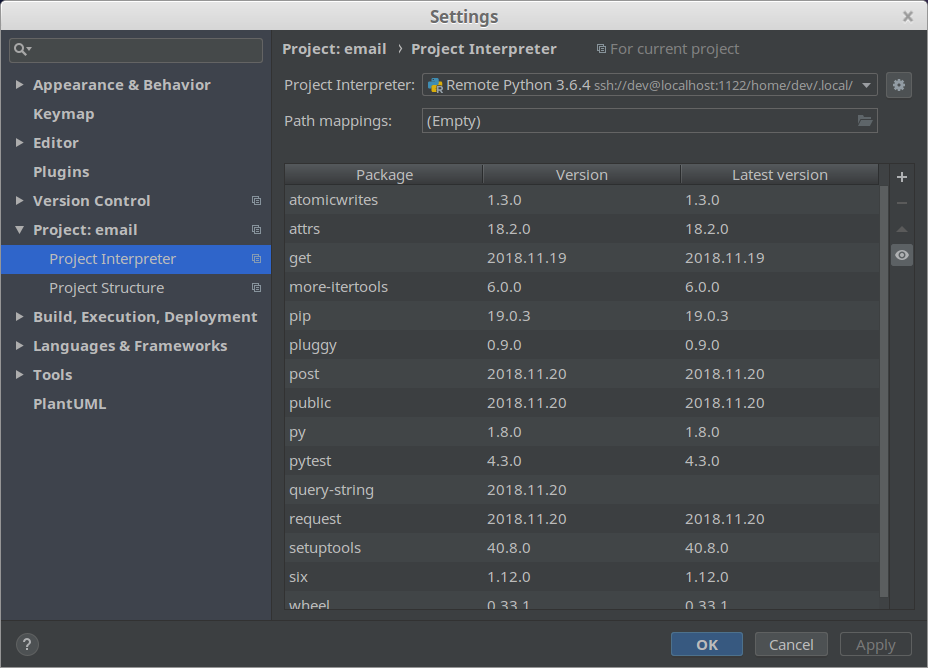

# pipenv

## General

### Install pipenv

    pip install --user pipenv

The option tells `pip` to install `pipenv` into the home directory of the current user.

`pipenv` will be located under the following directory:

    ${HOME}/.local/bin/

Thus, set the user PATH environment variable accordingly (into `~/.bashrc`):

    export PATH="${HOME}/.local/bin/:${PATH}"

### For pipenv, a project \_IS\_ a virtual environment... so to speak

See [this discussion](https://github.com/pypa/pipenv/issues/2615).

* a project is materialised by the presence of a file called "`Pipfile`".
* `pipenv` associates a virtual environment to the presence of a file called "`Pipfile`".

Thus, **there is a _bijective relationship_ between "projects" and "virtual environments"**: a project is associated with one and only one virtual environment. And a virtual environment is associated with one and only one poject.

Although the concept of _virtual environment_ and the concept of _project_ are not identical, we can say that these expressions ("virtual environment" and "project") are interchangeable - since one is always associated with the other.

### Get the list of environment variables use by pipenv

This command can be really useful.

    $ pipenv --envs
    The following environment variables can be set, to do various things:

      - PIPENV_IS_CI
      - PIPENV_CACHE_DIR
      - PIPENV_COLORBLIND
      - PIPENV_DEFAULT_PYTHON_VERSION
      - PIPENV_DONT_LOAD_ENV
      - PIPENV_DONT_USE_PYENV
      - PIPENV_DOTENV_LOCATION
      - PIPENV_EMULATOR
      - PIPENV_HIDE_EMOJIS
      - PIPENV_IGNORE_VIRTUALENVS
      - PIPENV_INSTALL_TIMEOUT
      - PIPENV_MAX_DEPTH
      - PIPENV_MAX_RETRIES
      - PIPENV_MAX_ROUNDS
      - PIPENV_MAX_SUBPROCESS
      - PIPENV_NO_INHERIT
      - PIPENV_NOSPIN
      - PIPENV_SPINNER
      - PIPENV_PIPFILE
      - PIPENV_PYPI_MIRROR
      - PIPENV_SHELL_EXPLICIT
      - PIPENV_SHELL_FANCY
      - PIPENV_TIMEOUT
      - PIPENV_VENV_IN_PROJECT
      - PIPENV_YES
      - PIPENV_SKIP_LOCK
      - PIPENV_PYUP_API_KEY
      - PIPENV_PYTHON
      - PIPENV_TEST_INDEX
      - PIPENV_USE_SYSTEM
      - PIPENV_VIRTUALENV
      - PIPENV_SKIP_VALIDATION
      - PIPENV_SHELL
      - PIPENV_VERBOSITY
      - PIPENV_SPINNER_FAIL_TEXT
      - PIPENV_SPINNER_OK_TEXT

    You can learn more at:
       http://docs.pipenv.org/advanced/#configuration-with-environment-variables

### Install a package

    pipenv install <name of the package>

Example:

    pipenv install pytest

### Uninstall a package

    pipenv uninstall crypto

### Uninstall all installed packages

    pipenv uninstall --all

### Install a "local package" into your virtual environment

    pipenv install -e .

> See [this tutorial](https://python-packaging.readthedocs.io/en/latest/minimal.html).

### Print the list of all installed dependencies

    pipenv graph    

# Virtual environment

## Create a "virtual environment / project"

    cd /the/project/directory
    pipenv install --python 3.6.4

> See [this link](https://pipenv.readthedocs.io/en/latest/) for all the available options.

This will create two new files, `Pipfile` and `Pipfile.lock`, in your project directory, and a new virtual environment for your project if it doesn’t exist already.

> Here, we specify that we want to use Python version `3.6.4` (instead of the default version of Python available on this host).

> This command assumes that `python 3.6.4` is already installed.

Once a "_virtual environment / project_" has been created, we can activate it. See [Activate a virtual environment](#activate-a-virtual-environment).

## Delete a "virtual environment / project"

To run the command below, you must be in the project directory tree (which contains the file called "Pipfile" at its top).

    pipenv --rm

## Get the path to the directory that contains a "virtual environment / project" configuration

To run the command below, you must be in the project directory tree (which contains the file called "Pipfile" at its top).

    $ pipenv --venv
    /home/dev/.local/share/virtualenvs/tmp-SWmmaX4T

    $ ls /home/dev/.local/share/virtualenvs/tmp-SWmmaX4T
    bin  include  lib

As you can see, the directory contains all the "elements" that defines a Python environment.

## Activate a virtual environment

### From the shell

To activate a virtual environment (bound to a project), go to the root directory of the project and run the command below:

    pipenv shell

Within this shell, all Python related commands will refer to the version of Python specified by the command `pipenv --python`.

### From a Python script

Typically the method is used within a WSGI application.

First, find the file named "`activate_this.py`" (that contains the code that activates the virtual environment).

From the project directory:

    find $(pipenv --venv) -name "activate_this.py"

Or:

    ls "$(pipenv --venv)/bin/activate_this.py"

For example:

    $ find $(pipenv --venv) -name "activate_this.py"
    /home/thermo/.local/share/virtualenvs/thermo_test-IVHwWUHZ/bin/activate_this.py

    $ ls "$(pipenv --venv)/bin/activate_this.py"
    /home/thermo/.local/share/virtualenvs/thermo_test-IVHwWUHZ/bin/activate_this.py

Then, within the python script:

    activator = '/home/thermo/.local/share/virtualenvs/thermo_test-IVHwWUHZ/bin/activate_this.py'
    with open(activator) as f:
        exec(f.read(), {'__file__': activator})

> This code works for Python 3 only.

### Get the path to the project associated with the current virtual environment

    (tmp) dev@unassigned-hostname:~/tmp$ pipenv --where
    /home/dev/tmp

### Get the path to the python interpreter assigned to the current "virtual environment / project"

    $ ls -l $(pipenv --py)
    lrwxrwxrwx 1 dev dev 9 Feb 28 10:47 /home/dev/.local/share/virtualenvs/tmp-SWmmaX4T/bin/python -> python3.6

# Pycharm

## Pipenv on a remote host with PyCharm (2018.3)

From within the project _virtual environment_ (`pipenv shell`), _on the remete host_, run the following command:

    (email) ...$ which python
    /home/dev/.local/share/virtualenvs/email-7PV48K4_/bin/python

This will give you the path to the Python interpreter used within that environment.

Then you specify the _absolute path_ to _this_ Python interpreter within the project interpreter settings (within PyCharm).

All the packages installed on the _remote environment_ (on the remote host) can be seen on the "project interpreter settings page". Thus, if you see these packages, then it means that PyCharm knows about them.

**However, it takes time for PyCharm to process these data and refresh the code being edited**. See [Cleaning System Cache](https://www.jetbrains.com/help/pycharm/cleaning-system-cache.html).

If you think that it takes too much time, then you can:

* Clean PyCharm cache. See [Cleaning System Cache](https://www.jetbrains.com/help/pycharm/cleaning-system-cache.html). Please note that this will take time...
* Hit "Refresh" on the "project interpreter settings page". If the "Refresh" link is not visible, then it means that there is nothing to refresh.

# Troubleshooting

## Step 1: print the content of the file "`Pipfile`"

Print the content of the file "`Pipfile`". Make sure that the list of packages does not contain a package that does not exist. For example:

    [packages]
    google-api-python-client = "*"
    google-auth-httplib2 = "*"
    google-auth-oauthlib = "*"
    flask = "*"
    google-auth = "*"
    requetes = "*"
    requests = "*"

The package "`requetes`" does not exist.

You may have asked `pipenv` to install an unknown package (for example: "`requetes`"). Typically, you've made a typo in the name of the package. The request failed, or course. However, `pipenv` has included the package in the list of required packages. **Thus, any further request to install a well-known package will fail since it is impossible to resolve dependencies (due to the presence of an unknown package in the list of dependencies)**.

If you requested the installation of an unknown package, then remove it from the list of requested packages. Then clear the lock file (see step 2).

## Step 2: clear the lock file and reinstall all dependencies

    pipenv --clear lock && pipenv install

## Step 3 : print the list of all installed dependencies

If you still have difficulties, then you may examine the dependencies graph.

    pipenv graph

