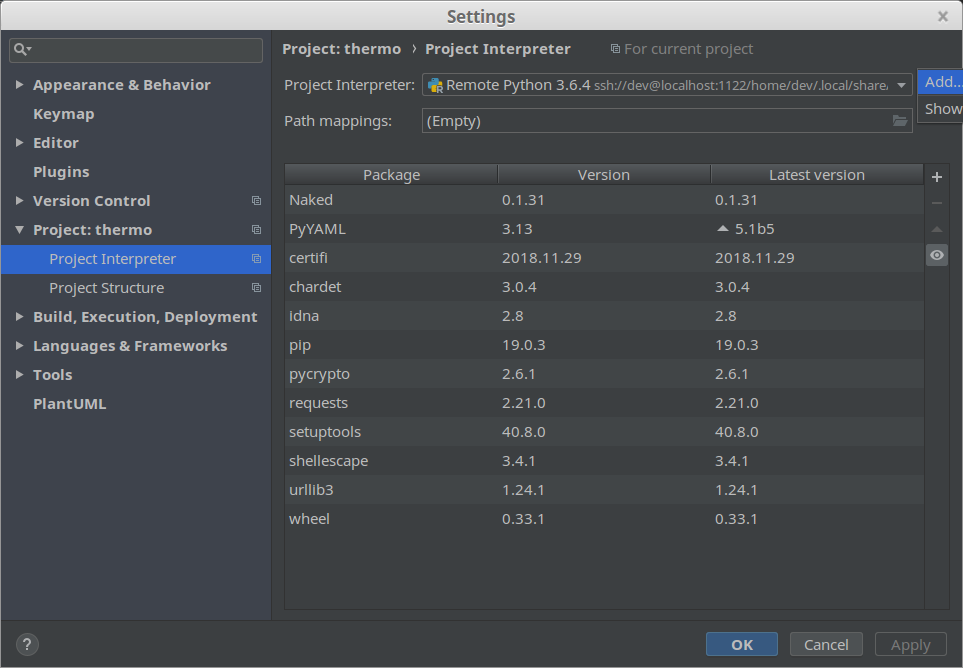
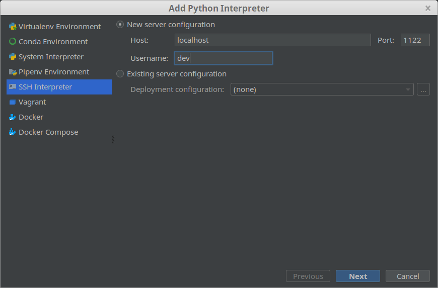
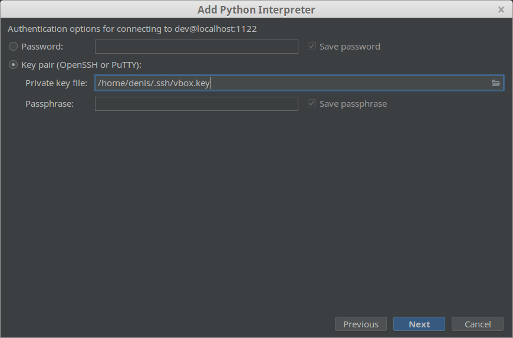
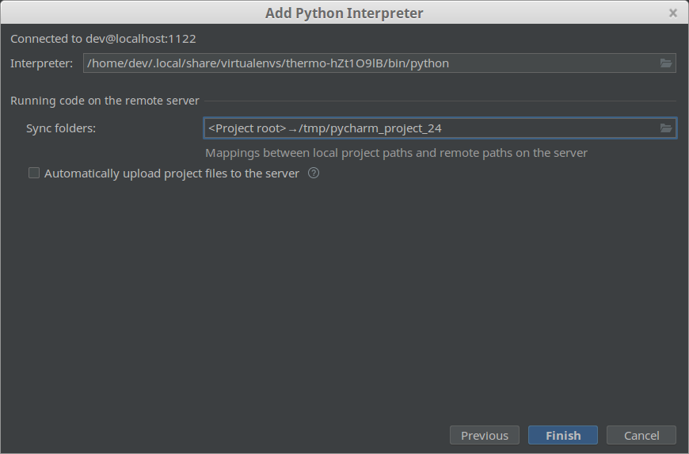
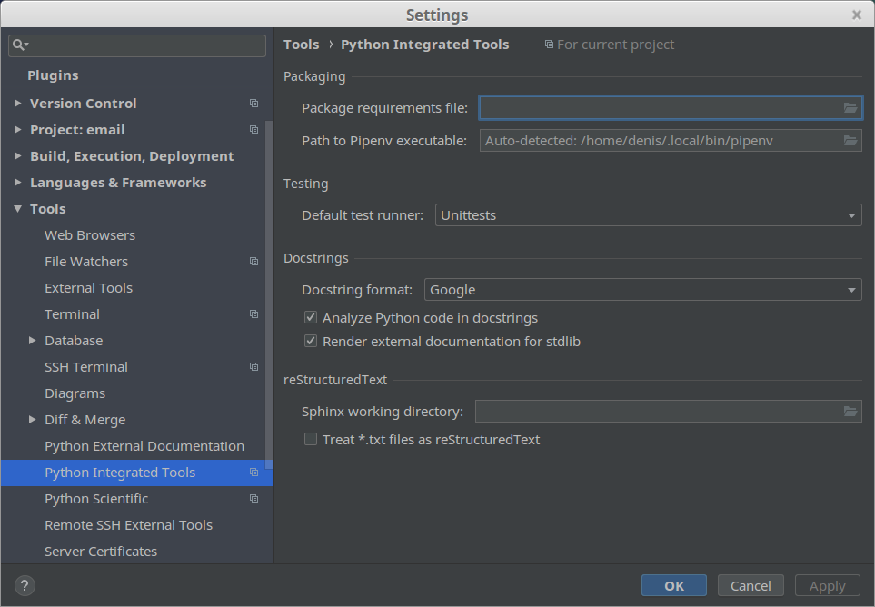

# PyCharm

This document contains useful information for using PyCharm.

# Configuring a remote Python interpreter

`File` **>** `Settings` **>** `Project Interpreter`

`Label[Project Interpreter]` **>** `Add`

Select `SSH Interpreter`

`Next` : set the network configuration for SSH.

`Next` : set the credentials for SSH.

`Next` : configure the interpreter.

> Make sure to specify the Python interpreter bound to the Pipven environment !

    (thermo) dev@unassigned-hostname:~/projects/thermo$ which python
    /home/dev/.local/share/virtualenvs/thermo-hZt1O9lB/bin/python

> If you are using a VM, then you should have set a shared folder. If that's the case then you would like to uncheck "_Automatically upload project files to the server_"

> Please note that if the remote host is a VM running on the same host as the one running PyCharm (let's call it, the "_editor host_"), then you probably used a shared directory (between the VM and the "_editor host_"). In this case, you don't need to configure any _deployment settings_ ("`Build, Extension, Deployment`" => "`Deployment`": **leave everything empty**).

# Configuring the docstring format

# Comments used to configure the code analysis

This list comes for the [excellent document](https://gist.github.com/pylover/7870c235867cf22817ac5b096defb768).

    # noinspection PyPep8
    # noinspection PyPep8Naming
    # noinspection PyTypeChecker
    # noinspection PyAbstractClass
    # noinspection PyArgumentEqualDefault
    # noinspection PyArgumentList
    # noinspection PyAssignmentToLoopOrWithParameter
    # noinspection PyAttributeOutsideInit
    # noinspection PyAugmentAssignment
    # noinspection PyBroadException
    # noinspection PyByteLiteral
    # noinspection PyCallByClass
    # noinspection PyChainedComparsons
    # noinspection PyClassHasNoInit
    # noinspection PyClassicStyleClass
    # noinspection PyComparisonWithNone
    # noinspection PyCompatibility
    # noinspection PyDecorator
    # noinspection PyDefaultArgument
    # noinspection PyDictCreation
    # noinspection PyDictDuplicateKeys
    # noinspection PyDocstringTypes
    # noinspection PyExceptClausesOrder
    # noinspection PyExceptionInheritance
    # noinspection PyFromFutureImport
    # noinspection PyGlobalUndefined
    # noinspection PyIncorrectDocstring
    # noinspection PyInitNewSignature
    # noinspection PyInterpreter
    # noinspection PyListCreation
    # noinspection PyMandatoryEncoding
    # noinspection PyMethodFirstArgAssignment
    # noinspection PyMethodMayBeStatic
    # noinspection PyMethodOverriding
    # noinspection PyMethodParameters
    # noinspection PyMissingConstructor
    # noinspection PyMissingOrEmptyDocstring
    # noinspection PyNestedDecorators
    # noinspection PynonAsciiChar
    # noinspection PyNoneFunctionAssignment
    # noinspection PyOldStyleClasses
    # noinspection PyPackageRequirements
    # noinspection PyPropertyAccess
    # noinspection PyPropertyDefinition
    # noinspection PyProtectedMember
    # noinspection PyRaisingNewStyleClass
    # noinspection PyRedeclaration
    # noinspection PyRedundantParentheses
    # noinspection PySetFunctionToLiteral
    # noinspection PySimplifyBooleanCheck
    # noinspection PySingleQuotedDocstring
    # noinspection PyStatementEffect
    # noinspection PyStringException
    # noinspection PyStringFormat
    # noinspection PySuperArguments
    # noinspection PyTrailingSemicolon
    # noinspection PyTupleAssignmentBalance
    # noinspection PyTupleItemAssignment
    # noinspection PyUnboundLocalVariable
    # noinspection PyUnnecessaryBackslash
    # noinspection PyUnreachableCode
    # noinspection PyUnresolvedReferences
    # noinspection PyUnusedLocal
    # noinspection ReturnValueFromInit

